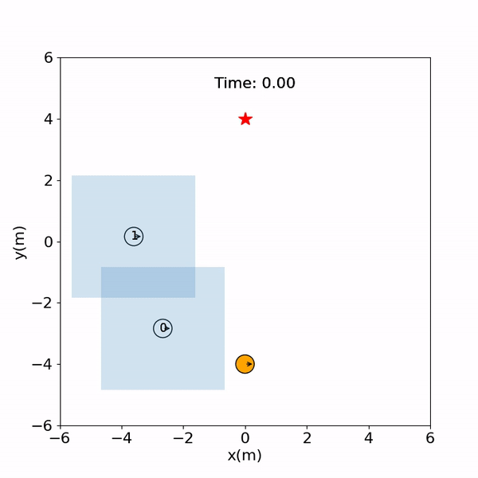

# CrowdNav
This repository contains the code for my paper. For more details, please refer to the paper
[Social navigation with human empowerment driven reinforcement learning](https://arxiv.org/abs/1809.08835).


## Abstract
The next generation of mobile robots needs to be socially-compliant to be accepted by humans. As simple as this task may seem, 
defining compliance formally is not trivial. Yet, classical reinforcement learning (RL) relies upon hard-coded reward signals.
In this work, we go beyond this approach and provide the agent with intrinsic motivation using empowerment. 
Empowerment maximizes the influence of an agent on its near future and has been shown to be a good model for biological 
behaviors. It also has been used for artificial agents to learn complicated and generalized actions. Self-empowerment 
maximizes the influence of an agent on its future. On the contrary, our robot strives for the empowerment of people in 
its environment, so they are not disturbed by the robot when pursuing their goals. 
We show that our robot has a positive influence on humans, as it minimizes the travel time and distance of humans while moving efficiently to its own goal.
The method can be used in any multi-agent system that requires a robot to solve a particular task involving humans interactions.


## Method Overview
The robot uses the states of all its neighbors to compute their empowerment. Empowerment is used in addition to 
state-value estimates. In this way, SCR learns to not collide with humans (from state-values) as well as giving them the 
ability to pursue their goals (from empowerment estimates).

[comment]: <> ( plot value function, 1 human 1 robot not blocking.)
[comment]: <> ( plot value function, 1 human 1 robot blocking.)

The human states are occupancy maps centered around them. These provide enough information on whether an action
would have influence or not, because occupied areas block their movement. Empowerment is computed from these maps and their
actions, which are 2 (dx, dy movements) continuous samples obtained from normal distributions. 

[comment]: <> ( empowerment landschape, 1 human 1 robot not blocking.)
[comment]: <> ( empowerment landschape, 1 human 1 robot blocking.)

## Simulation Videos
IL             | SCR
:-------------------------:|:-------------------------:
|


## Setup
1. Install [Python-RVO2](https://github.com/sybrenstuvel/Python-RVO2) library
2. Install crowd_sim and crowd_nav into pip
```
pip install -e .
```

## Getting started
This repository is organized in two parts: gym_crowd/ folder contains the simulation environment and
crowd_nav/ folder contains codes for training and testing the policies. Details of the simulation framework can be found
[here](crowd_sim/README.md). Below are the instructions for training and testing policies, and they should be executed
inside the crowd_nav/ folder.


1. Train a policy.
```
python train.py --policy sarl
```
2. Test policies with 500 test cases.
```
python test.py --policy orca --phase test
python test.py --policy sarl --model_dir data/output --phase test
```
3. Run policy for one episode and visualize the result.
```
python test.py --policy orca --phase test --visualize --test_case 0
python test.py --policy sarl --model_dir data/output --phase test --visualize --test_case 0
```
4. Visualize a test case.
```
python test.py --policy sarl --model_dir data/output --phase test --visualize --test_case 0
--policy sarl --model_dir data/output --phase test --visualize --test_case 0 --video_file data/output/video.mp4 --plot_file data/output/plot.png 

```
5. Plot training curve.
```
python utils/plot.py data/output/output.log
```


## Simulation Videos
CADRL             | LSTM-RL
:-------------------------:|:-------------------------:
|
SARL             |  OM-SARL
|


## Learning Curve
Learning curve comparison between different methods in an invisible setting.


## Citation
If you find the codes or paper useful for your research, please cite our paper:
```
@misc{1809.08835,
Author = {Changan Chen and Yuejiang Liu and Sven Kreiss and Alexandre Alahi},
Title = {Crowd-Robot Interaction: Crowd-aware Robot Navigation with Attention-based Deep Reinforcement Learning},
Year = {2018},
Eprint = {arXiv:1809.08835},
}
```
